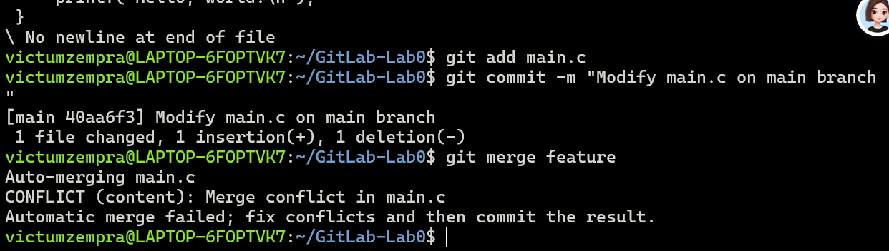
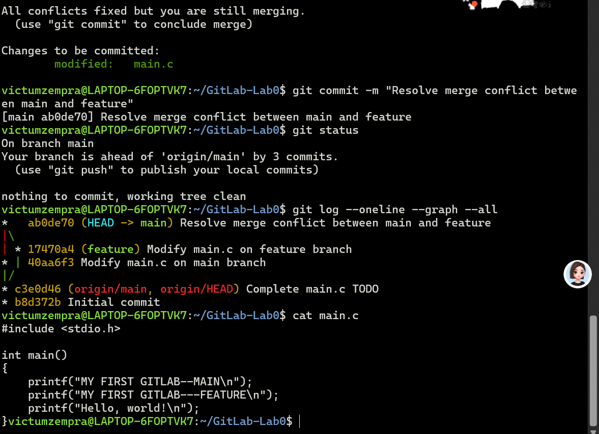

# Lab0: GitLab 实验报告

姓名：吴梓霆
学号：24300120064

## 1. 实验目的

这次主要就是熟悉一下 Git，clone、改文件、add、commit、push，还有 branch 和 merge。另外老师要求必须自己搞一次 merge conflict 再解决掉，所以后面专门弄了这个。

环境是 Windows 的 WSL Ubuntu，编辑器用的 VS Code / Cursor。

## 2. 文档问题

### 2.1 之前是否有过多人协同开发的经历？如果有，使用什么方式分工协作？

之前没有正式用 Git 做过多人开发。小组作业基本就是各写各的，最后微信传文件，或者丢网盘里，谁有空谁来合并。

文件少的时候还行，但好几个人同时改一个东西就很容易乱，也不知道哪个才是最终版。做完这次实验感觉还是 branch + merge 比较靠谱，各改各的分支，最后再合。

### 2.2 Git 为什么要设计“暂存—提交”两个步骤？

我理解暂存区就是让你自己挑哪些改动要放进下一次 commit。

比如同时改了好几个文件，但只有一个改完了，就可以先 git add 这个，别的先不管，确认没问题再 git commit。

这次改完 main.c 我先看了 git status，那时候还是 modified。git add main.c 之后才变成待提交，然后再 commit。感觉就是提交前多了一步确认，commit 里的内容会清楚一点。

### 2.3 git branch 和 git branch -a 有什么区别？

git branch 看的是本地分支，当前这个前面会有个 *。实验里跑出来是：

feature
* main

就是本地有 feature 和 main，现在在 main 上。

git branch -a 会把远程的也列出来：

feature
* main
remotes/origin/HEAD -> origin/main
remotes/origin/feature
remotes/origin/main

所以一个是本地，一个本地+远程都能看到。

## 3. 实验环境

Windows + WSL Ubuntu，Git 2.43.0，GitHub。编辑器用 VS Code / Cursor。GitHub 用户名 DunkelByte，仓库名 GitLab-Lab0。

## 4. 实验过程

### 4.1 检查 Git 配置

先在 WSL 里敲了 git --version，显示 git version 2.43.0，说明装过了。

然后 git config --global user.name 和 git config --global user.email 看了一下，之前配过，就没再设。

### 4.2 检查 SSH

ls -al ~/.ssh 一看，id_ed25519 和 id_ed25519.pub 都在，所以 key 也没重新生成。

接着 ssh -T git@github.com，出来这句：

Hi DunkelByte! You've successfully authenticated, but GitHub does not provide shell access.

一开始看到 does not provide shell access 还以为失败了，后来才注意到前面已经 successfully authenticated 了。GitHub 本来就不给 SSH shell，这个是正常的。

### 4.3 创建并克隆仓库

去课程给的模板仓库点 Use this template，建了自己的仓库，名字叫 GitLab-Lab0。

然后用 SSH clone：

git clone git@github.com:DunkelByte/GitLab-Lab0.git

cd GitLab-Lab0 进去，ls 看到 Makefile、README.md、main.c。git status 显示在 main 上，工作区也是 clean 的。顺手 git remote -v 看了下，origin 指向的是自己的仓库。

### 4.4 修改 main.c

打开 main.c，原来有一行 printf("Hello, world!\n");

我加了一行 printf("MY FIRST GITLAB\n");

保存后用 git diff 看了下改了什么。然后 make 编译，跑 ./main，输出是：

MY FIRST GITLAB
Hello, world!

能跑就行。最后 make clean 把 main 和 main.o 清掉了。

### 4.5 第一次 commit

git status 显示 modified: main.c。然后 git add main.c，再看一次 status，已经在 Changes to be committed 里了。

提交：git commit -m "Complete main.c TODO"

git log --oneline 看到：

c3e0d46 Complete main.c TODO
b8d372b Initial commit

这时提示本地 main 比 origin/main 多一个 commit，所以又 git push origin main 推上去了。

### 4.6 创建 feature 分支

git switch -c feature，创建并切过去。git branch 出来：

* feature
  main

已经在 feature 上了。

### 4.7 在 feature 分支修改代码

后面要故意制造冲突，所以在 feature 上把刚才那行改成 printf("MY FIRST GITLAB---FEATURE\n");

看了下 git diff，然后 git add main.c，再 commit：git commit -m "Modify main.c on feature branch"

feature 这边就算改完了。

### 4.8 回到 main 分支继续修改

git switch main 切回去。切完之后编辑器里的文件内容也跟着变回 main 的版本了，这点挺直观的，分支之间确实不是同一份东西。

然后在 main 上把同一处改成 printf("MY FIRST GITLAB--MAIN\n");

git add main.c，再 git commit -m "Modify main.c on main branch"

这样两个分支改的是 main.c 同一个地方，但内容不一样。

### 4.9 产生 merge conflict

在 main 上执行 git merge feature，然后就冲突了：

Auto-merging main.c
CONFLICT (content): Merge conflict in main.c
Automatic merge failed; fix conflicts and then commit the result.

两个分支对同一处改得不一样，Git 不知道留哪个，所以没自动 merge 成功。

git status 里也能看到 You have unmerged paths. 和 both modified: main.c。main.c 现在就是冲突状态。

### 4.10 解决冲突

打开 main.c，Git 在里面插了这种标记：<<<<<<< HEAD 是 main 分支的内容，======= 下面是 feature 分支的内容，最后是 >>>>>>> feature。

HEAD 是当前这个 main，下面是 feature 要合进来的。我这边两个都留了，最后改成：

printf("MY FIRST GITLAB--MAIN\n");
printf("MY FIRST GITLAB---FEATURE\n");
printf("Hello, world!\n");

把 <<<<<<<、=======、>>>>>>> 这些标记全删掉再保存。然后 git add main.c。

再看 git status，显示 All conflicts fixed but you are still merging.

冲突是解了，但 merge 还差一次 commit。所以 git commit -m "Resolve merge conflict between main and feature"

这样就合完了。

### 4.11 查看合并结果

git log --oneline --graph --all 看历史，大概是这样：

*   ab0de70 (HEAD -> main) Resolve merge conflict between main and feature
|\
| * 17470a4 (feature) Modify main.c on feature branch
* | 40aa6f3 Modify main.c on main branch
|/
* c3e0d46 Complete main.c TODO
* b8d372b Initial commit

能看出来 main 和 feature 从同一点分开，各自改了一次，最后又 merge 回来。

### 4.12 推送到 GitHub

冲突解完之后本地 main 比远程多了几个 commit，所以 git push origin main。feature 也 git push origin feature 一起推了。

git status 显示 Your branch is up to date with 'origin/main'. 以及 nothing to commit, working tree clean。

本地和 GitHub 上的 main 已经同步了。最后 git branch -a：

feature
* main
remotes/origin/HEAD -> origin/main
remotes/origin/feature
remotes/origin/main

## 5. 阅读材料总结

### 5.1 Commit Message 规范

第一篇看的是 commit message。我以前写 message 基本就是能看懂就行，但看完发现如果 commit 很多，全是 update、change 这种，过几天自己都想不起来改了啥。

比较常见的会按类型写，比如 feat 新功能、fix 修 bug、docs 改文档、style 改格式、refactor 重构、test 测试。小作业倒不一定每次都套这套，但至少得能看出来这次做了什么。

这次几个提交是 Complete main.c TODO、Modify main.c on feature branch、Modify main.c on main branch、Resolve merge conflict between main and feature。格式不算特别规范，但回头看 git log 基本能对上每一步。

### 5.2 语义化版本

另一篇是 Semantic Versioning，版本号一般写成 MAJOR.MINOR.PATCH，比如 2.4.1。MAJOR 是不兼容的大改，MINOR 是加功能但还兼容，PATCH 主要是修 bug。

比如 1.5.3 -> 2.0.0 基本就是大改，可能不兼容旧的；1.5.3 -> 1.6.0 是加功能；1.5.3 -> 1.5.4 一般是修问题。感觉这种编号不只是计数，还能大概看出这次改动有多大。

### 5.3 为什么要学习 Git？

以前觉得 Git 就是把代码传到 GitHub，branch、merge 这些基本没认真用过。自己走完一遍之后感觉它更主要的还是管代码改动：每次 commit 都有记录，之后能看什么时候改了什么；branch 可以让不同修改先分开做，不用全堆在 main 上。

这次故意让两个分支改同一处，真碰到 conflict 再自己解，对这一点印象比较深。要是多人一起写，直接传文件很容易互相覆盖，也不知道谁改了啥。所以现在觉得 Git 不只是上传工具，更多是版本管理和协作。

## 6. 实验总结

这次把 clone、add、commit、push、branch、switch、merge、conflict 都走了一遍。前面 add / commit / push 还好，真正有感觉的是 branch 和 merge conflict。

之前知道有分支，但没太理解为什么一切换文件内容也会变。feature 和 main 各改一回之后就比较清楚了。conflict 也没想象中那么玄，Git 就是标出两边冲突的地方，最后留什么还得自己决定，解完再 add + commit，merge 才算结束。顺带把 git status、git diff、git log 用熟了一点，后面写项目应该会经常用到。
